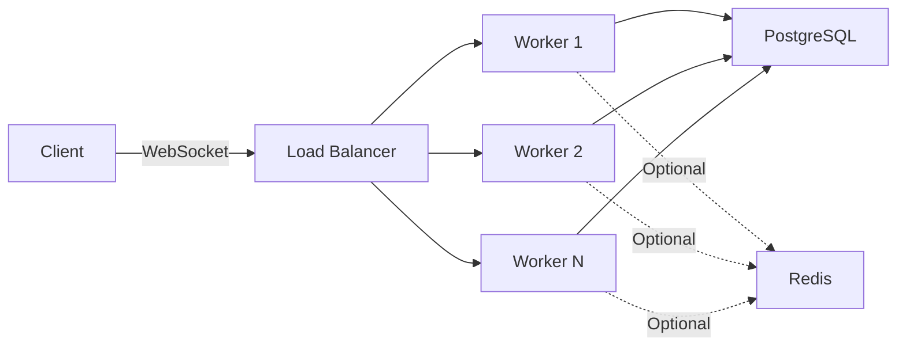

# EliteScore Chat Server - Architecture Documentation

Technical architecture and engineering documentation for a real-time WebSocket chat server. This repository contains architecture diagrams, system design documentation, and engineering specifications.

**Note**: Source code cannot be shown in this repository due to a signed NDA (Non-Disclosure Agreement) with EliteScore. This documentation repository contains architecture and engineering documentation only, without any proprietary source code.

## Overview

This repository documents the architecture and engineering design of a real-time messaging system that handles private messaging, group chats, and community chats. The system is built with Node.js, PostgreSQL, and optional Redis caching.

### System Capabilities

- **Private Messaging**: Direct messages with encryption, reactions, editing, and deletion
- **Group Chats**: Create groups, manage members, send announcements, pin messages
- **Community Chats**: Automatic infrastructure for community-based group chats
- **Offline Delivery**: Event queue system for delivering messages and events to offline users
- **Reconnection Handling**: Grace period system prevents false offline status during temporary disconnections
- **Security**: JWT authentication, message encryption, rate limiting, blocking/following checks
- **Performance**: Optimized database queries, in-memory caching, connection pooling

## Architecture

The system uses a multi-worker architecture via Node.js cluster module. Each worker process maintains its own WebSocket server and in-memory state, while sharing the same PostgreSQL database.



See [System Architecture Diagram](./diagrams/system-architecture.md) for detailed architecture.

## Message Flow

Messages flow through the following pipeline:

1. **Client sends message** via WebSocket
2. **Connection handler** validates authentication and rate limits
3. **Message router** routes to appropriate handler
4. **Message handler** processes message:
   - Validates blocking/following relationships
   - Encrypts message content
   - Saves to database (transactional)
   - Stores in memory cache
   - Delivers to recipient if online, or queues for offline delivery

See [Message Delivery Flow Diagram](./diagrams/message-delivery-flow.md) for detailed sequence.

## Reconnection and Offline Delivery

The system implements a grace period mechanism for handling disconnections:

1. **Disconnection detected**: WebSocket close event received
2. **Grace period starts**: 60-second timer begins
3. **Reconnection within grace period**: User remains online, receives queued events
4. **Grace period expires**: User marked offline, events remain queued in database

When a user reconnects:
- In-memory queued events delivered first (fast)
- Database queued events loaded and delivered (persistent)
- Events marked as delivered in database
- User receives all missed events in chronological order

See [Reconnection Flow Diagram](./diagrams/reconnection-flow.md) for detailed sequence.

## Scaling Model

The server uses Node.js cluster module to spawn multiple worker processes:

- **Single worker (development)**: Single process mode
- **Multiple workers (production)**: Cluster mode (spawns workers based on CPU cores, max 8)

Each worker:
- Handles a subset of WebSocket connections
- Maintains its own in-memory state (clients, conversations, groups)
- Shares the same PostgreSQL database
- Can optionally share Redis for cross-worker caching

**Limitation**: Users connected to different workers cannot see each other's real-time presence. This requires Redis pub/sub or a message broker for true multi-worker presence synchronization.

## Storage Model

### Database (PostgreSQL)

- Messages table: All messages (encrypted at rest)
- Groups table: Group metadata
- Memberships table: Group membership and roles
- Event queue table: Queued events for offline users
- Conversations table: Conversation metadata
- Reactions table: Message reactions
- Deletions table: Per-user message deletion records

### In-Memory (Maps)

- **clients**: Active WebSocket connections (clientId -> {ws, user, lastActivity})
- **userConnections**: User ID to client ID mapping
- **conversations**: Active conversation state (last 50-100 messages)
- **groups**: Active group state (last 50-100 messages)
- **eventQueues**: In-memory event queue (userId -> Array of events)

### Redis (Optional)

- Session data: `session:{clientId}` (TTL: 1 hour)
- Message cache: `message:{messageId}` (TTL: 1 hour)
- Conversation cache: `conversation:{conversationId}` (last 100 messages)

## API Reference

### WebSocket Messages

**Authentication:**
- `authenticate` / `auth`: Authenticate with JWT token

**Private Messaging:**
- `send_private_message`: Send a private message
- `get_private_messages`: Load message history
- `mark_message_read`: Mark message as read
- `edit_message`: Edit a message (5-minute window)
- `delete_message`: Delete a message
- `add_reaction` / `remove_reaction`: Manage reactions
- `typing`: Send typing indicator

**Group Chats:**
- `create_group`: Create a new group
- `send_group_message`: Send a group message
- `get_group_messages`: Load group message history
- `add_group_member` / `remove_group_member`: Manage members
- `promote_member` / `demote_member`: Manage roles
- `pin_message` / `unpin_message`: Pin/unpin messages
- `send_announcement`: Send admin announcement

See [API Reference](./docs/API_REFERENCE.md) for complete message types and HTTP endpoints.

## Health Checks

- **GET /health**: Server health status, metrics, memory usage
- **GET /ready**: Readiness probe (checks database connection)
- **GET /live**: Liveness probe (server is running)
- **GET /metrics**: Detailed metrics and performance data

## Documentation

### Architecture and Design
- [System Architecture](./docs/ARCHITECTURE.md): Detailed system design and components
- [System Design](./docs/SYSTEM_DESIGN.md): Complete architecture and design overview
- [Message Flow](./docs/ARCHITECTURE.md#message-flow): How messages flow through the system (see Architecture doc)
- [Reconnection Handling](./docs/IMPLEMENTATION_DETAILS.md#reconnection-logic-and-backoff): Offline delivery and reconnection logic (see Implementation Details)
- [Caching Strategy](./docs/SYSTEM_DESIGN.md#performance-optimizations): Redis and in-memory caching (see System Design)
- [Scaling Guide](./docs/SCALING.md): Horizontal scaling and cluster setup
- [Database Schema](./docs/DATABASE_SCHEMA.md): Complete database schema with indexes and query optimization

### Performance and Reliability
- [Systems Thinking & Scalability](./docs/SYSTEMS_THINKING_SCALABILITY.md): Complete guide to concurrency, scalability, reliability, and monitoring
- [Concurrency and Event Loop](./docs/SYSTEMS_THINKING_SCALABILITY.md#event-loop--backpressure): Node.js event loop, blocking operations, high load behavior
- [Fault Tolerance](./docs/FAULT_TOLERANCE.md): Crash handling, partial failures, retry mechanisms, message guarantees
- [Performance Monitoring](./docs/SYSTEMS_THINKING_SCALABILITY.md#monitoring--alerting): Latency measurement, event loop monitoring, profiling tools
- [Performance Characteristics](./docs/SYSTEM_DESIGN.md#performance-characteristics): Throughput calculations, latency analysis, performance optimizations

### API and Integration
- [API Reference](./docs/API_REFERENCE.md): Complete WebSocket and HTTP API documentation
- [Sequence Diagrams](./diagrams/): Detailed interaction flows (see diagrams folder)
  - [Message Delivery Flow](./diagrams/message-delivery-flow.md)
  - [Reconnection Flow](./diagrams/reconnection-flow.md)
  - [System Architecture](./diagrams/system-architecture.md)

### Implementation Details
- [Implementation Details](./docs/IMPLEMENTATION_DETAILS.md): Security, connection lifecycle, and configuration
- [Database Schema](./docs/DATABASE_SCHEMA.md): Complete database schema with relationships and indexes

### Diagrams
- [System Architecture](./diagrams/system-architecture.md): High-level architecture diagram
- [Message Delivery Flow](./diagrams/message-delivery-flow.md): Message delivery sequence
- [Reconnection Flow](./diagrams/reconnection-flow.md): Reconnection and offline sync flow

## Repository Structure

This repository contains architecture and engineering documentation only. Source code is not included due to NDA restrictions with EliteScore.

```
chat-server/
├── README.md                 # This file - architecture overview
├── LICENSE                   # MIT License
│
├── diagrams/                  # Architecture diagrams (Mermaid)
│   ├── system-architecture.md
│   ├── message-delivery-flow.md
│   └── reconnection-flow.md
│
└── docs/                     # Complete technical documentation
    ├── ARCHITECTURE.md       # Detailed system architecture
    ├── SYSTEM_DESIGN.md      # Complete architecture and design overview
    ├── API_REFERENCE.md      # Complete WebSocket and HTTP API reference
    ├── DATABASE_SCHEMA.md    # Database schema with indexes and relationships
    ├── IMPLEMENTATION_DETAILS.md  # Security, connection lifecycle, configuration
    ├── SCALING.md            # Scaling guide and cluster setup
    ├── FAULT_TOLERANCE.md    # Fault tolerance and error handling
    └── SYSTEMS_THINKING_SCALABILITY.md  # Complete scalability and systems thinking guide
```

## License

MIT License - see [LICENSE](./LICENSE) file for details.
