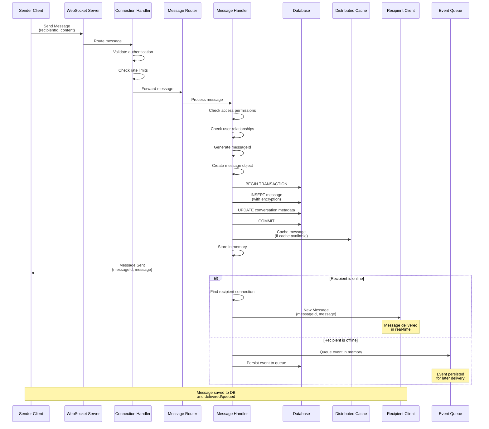

# Message Delivery Flow Diagram

## Message Delivery Pipeline

### 1. Message Reception
- Client sends message via WebSocket
- Connection handler validates authentication and rate limits
- Message router routes to appropriate handler

### 2. Validation & Processing
- Handler checks access permissions
- Handler checks user relationships
- Generates unique message ID
- Creates message object with metadata

### 3. Database Persistence
- Begins database transaction
- Encrypts message content
- Inserts into messages table with encrypted content
- Updates conversation metadata
- Commits transaction

### 4. Caching
- If distributed cache is available, caches message:
  - Individual message cache (TTL: 1 hour)
  - Conversation list cache (last 100 messages)

### 5. In-Memory Storage
- Stores message in memory for fast access
- Limits in-memory messages to last 50-100 per conversation
- Older messages are loaded from database on demand

### 6. Delivery
**If recipient is online:**
- Looks up recipient's active connection
- Sends new message event directly via WebSocket
- Delivery is immediate (real-time)

**If recipient is offline:**
- Queues event in in-memory queue
- Persists event to database event queue
- Event will be delivered when recipient reconnects

### 7. Confirmation
- Sender receives message sent confirmation
- Includes messageId and full message object

## Key Characteristics

- **Atomic Persistence**: Database operations use transactions to ensure consistency
- **Dual Storage**: Messages stored in both database (permanent) and memory (temporary cache)
- **Offline Support**: Events queued for offline users, delivered on reconnect
- **Encryption**: All messages encrypted at rest in database
- **Rate Limiting**: Prevents abuse with per-user and per-IP limits
