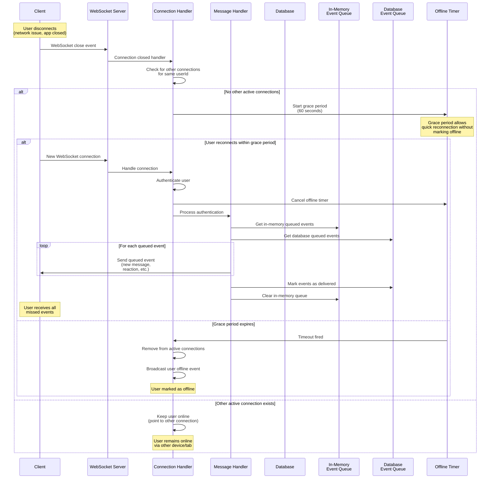

# Reconnection and Offline State Resynchronization Flow

## Reconnection Flow Details

### Disconnection Detection

When a WebSocket connection closes:

1. **Connection Handler** receives close event
2. Checks if user has other active connections (multiple tabs/devices)
3. If no other connections, starts a **grace period timer** (60 seconds)

### Grace Period

The 60-second grace period serves multiple purposes:

- **Quick Reconnection**: If user reconnects quickly (network hiccup), they remain "online" without interruption
- **Prevents False Offline**: Temporary network issues don't immediately mark user as offline
- **Allows Reconnection**: User has time to reconnect before being marked offline

### Reconnection Process

When user reconnects (within or after grace period):

1. **New WebSocket Connection**: Client establishes new WebSocket connection
2. **Authentication**: Client sends authentication message with token
3. **Connection Handler**:
   - Validates token with authentication service
   - Cancels any pending offline timer
   - Updates connection mappings with new connection ID
   - Updates session data
4. **Event Queue Delivery**:
   - **In-Memory Queue First**: Delivers events from memory queue (fast, immediate)
   - **Database Queue Second**: Loads events from database queue (persistent, survives restarts)
   - Events sent in chronological order (sorted by timestamp)
   - Small delay between events to prevent overwhelming client
5. **Mark as Delivered**: Updates database queue with delivery timestamp
6. **Clear Memory**: Removes events from in-memory queue after delivery

### Offline State

If grace period expires without reconnection:

1. User removed from active connections
2. User removed from session data
3. User offline event broadcast to all connected clients
4. Events remain queued in database for delivery on next connection

### Event Queue Types

Events queued for offline users include:

- **New messages**: Messages sent while offline
- **Reactions**: Message reactions added/removed
- **Edits**: Message edits
- **Deletions**: Message deletions
- **Membership changes**: Group membership changes
- **Group updates**: Group information updates

### Key Design Decisions

1. **Dual Queue System**: In-memory queue for speed, database queue for persistence
2. **Grace Period**: Prevents false offline status during temporary disconnections
3. **Chronological Delivery**: Events delivered in order they occurred
4. **Automatic Cleanup**: Delivered events cleaned up after retention period
5. **No Message Loss**: All events persisted to database, survive server restarts

### Limitations

- **Single Worker State**: In-memory event queue only works within same worker process
- **Cross-Worker Presence**: Users on different workers cannot see each other's real-time presence (would require message broker)
- **Event Ordering**: Events from different workers may arrive out of order (database queue ensures eventual consistency)
