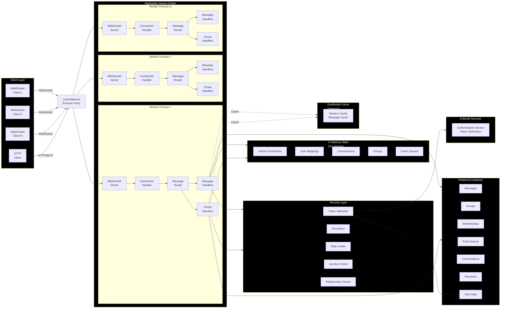

# System Architecture Diagram

## Architecture Overview

The real-time messaging system is a WebSocket-based application designed for horizontal scaling. The architecture consists of:

### Core Components

1. **WebSocket Server Layer**: Multiple worker processes handle WebSocket connections. Each worker maintains its own WebSocket server instance.

2. **Connection Handler**: Manages WebSocket lifecycle - connection establishment, authentication, timeout handling, and cleanup. Tracks client connections in memory.

3. **Message Router**: Routes incoming WebSocket messages to appropriate handlers based on message type (direct messages, group messages, authentication, etc.).

4. **Message Handlers**: Process direct messaging operations - sending, receiving, editing, deleting messages, managing reactions, and handling typing indicators.

5. **Group Handlers**: Process group chat operations - creating groups, sending group messages, managing members, handling group-specific reactions and announcements.

6. **In-Memory State**: Each worker process maintains data structures for:
   - Active connections tracking
   - User to connection mappings
   - Active conversation state
   - Active group state
   - Queued events for offline users

### Data Persistence

- **Relational Database**: Primary database for all persistent data:
  - Messages and metadata
  - Groups and memberships
  - Event queue for offline delivery
  - User relationships
  - Reactions

- **Distributed Cache (Optional)**: Caching layer for:
  - Session data
  - Recent messages
  - User metadata

### Security Layer

- **Token Authentication**: Verifies tokens with authentication service, checks revocation status
- **Message Encryption**: Encryption for message content at rest
- **Rate Limiting**: IP-based and user-based rate limits
- **Access Control**: Validates user relationships before allowing messaging

### Scaling Model

The system uses a cluster module to spawn multiple worker processes. Each worker:
- Handles a subset of WebSocket connections
- Maintains its own in-memory state
- Shares the same relational database
- Can optionally share distributed cache for cross-worker caching

Since each worker maintains separate in-memory state, users connected to different workers cannot see each other's real-time presence. This is a limitation of the current architecture that would require a message broker or pub/sub system to resolve for true multi-worker presence.
