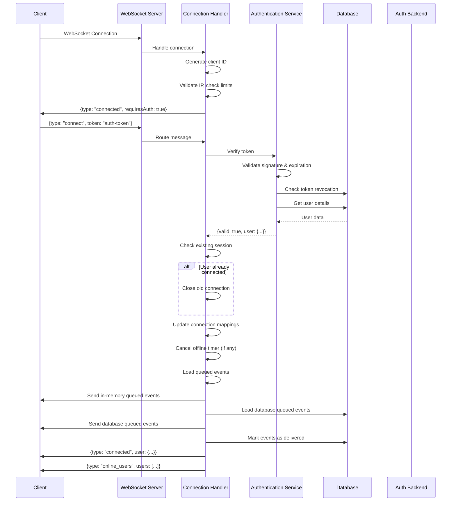
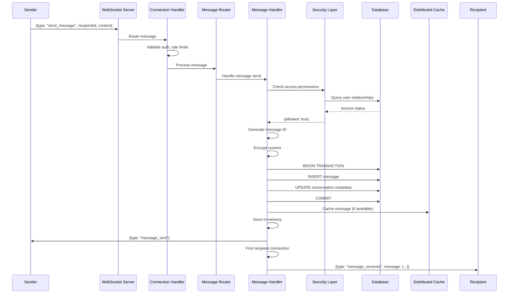
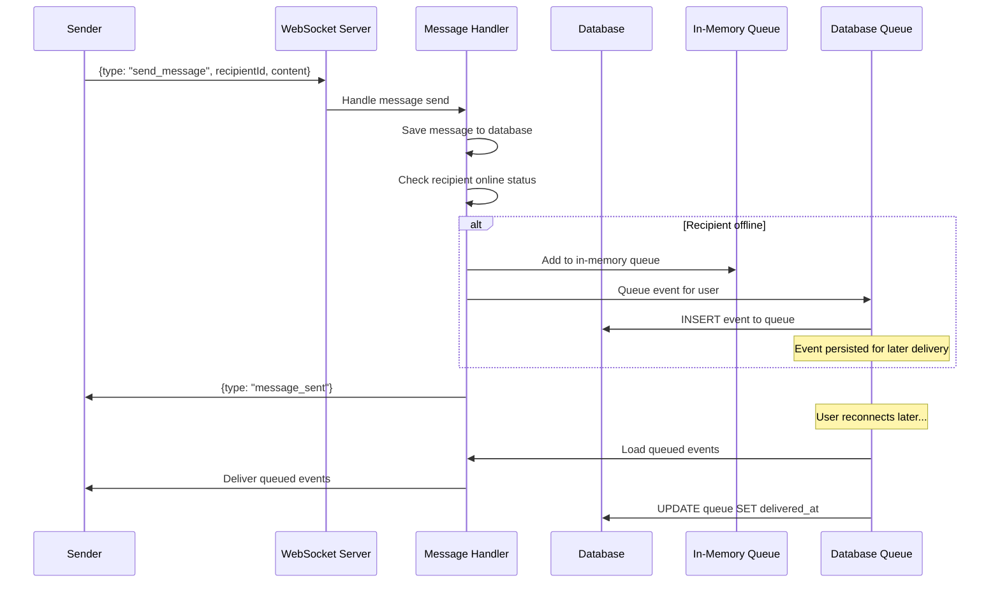
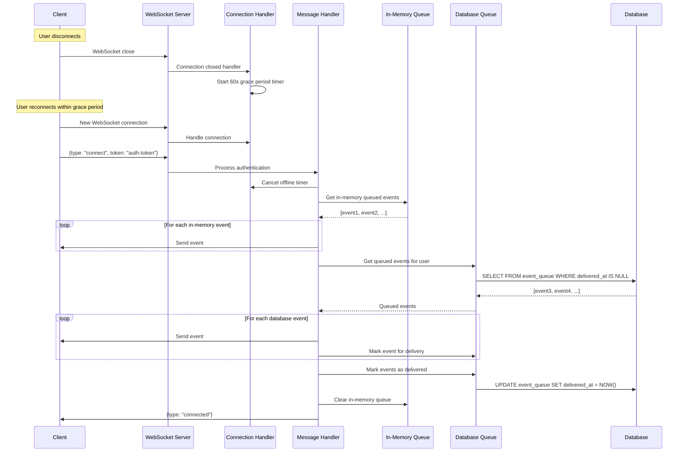
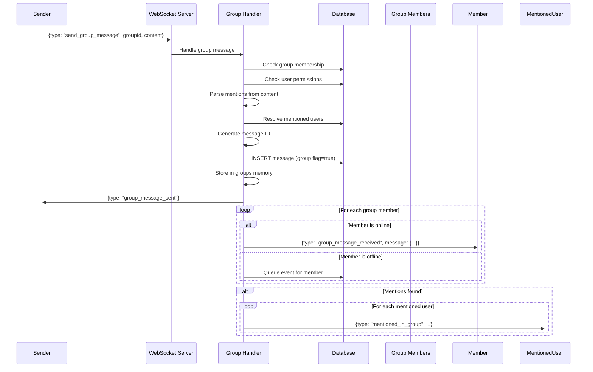
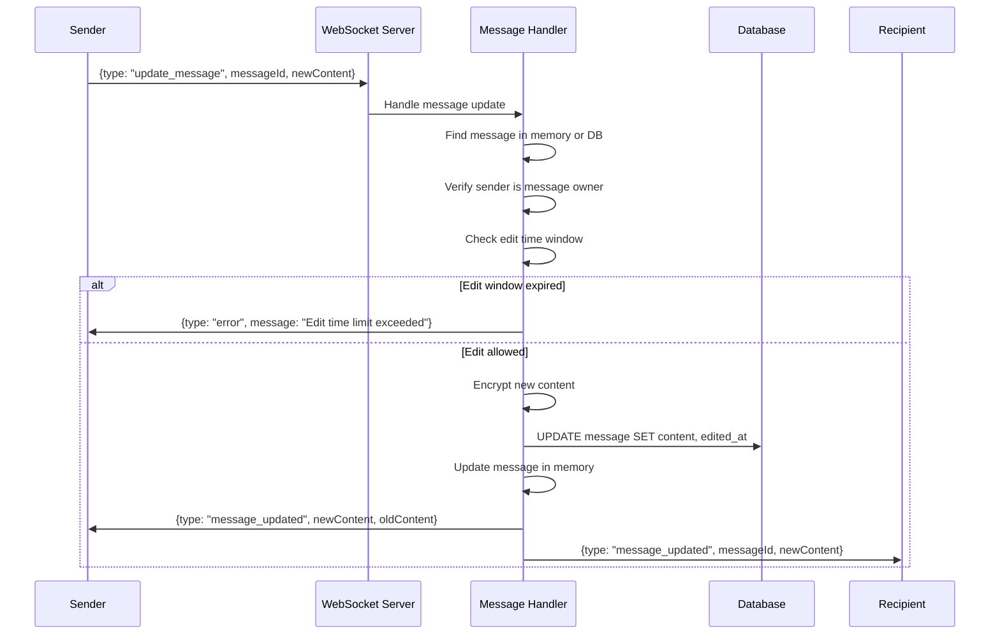
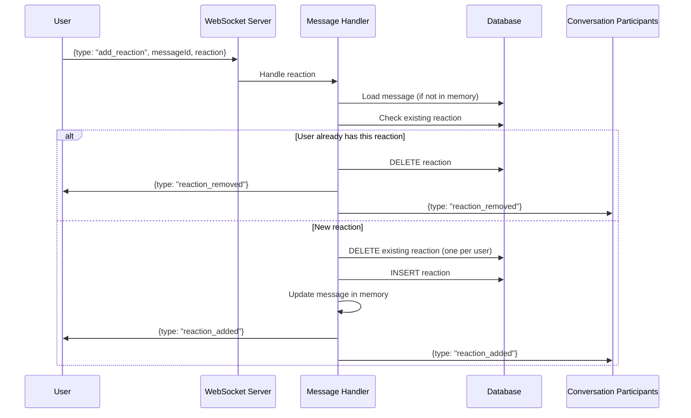
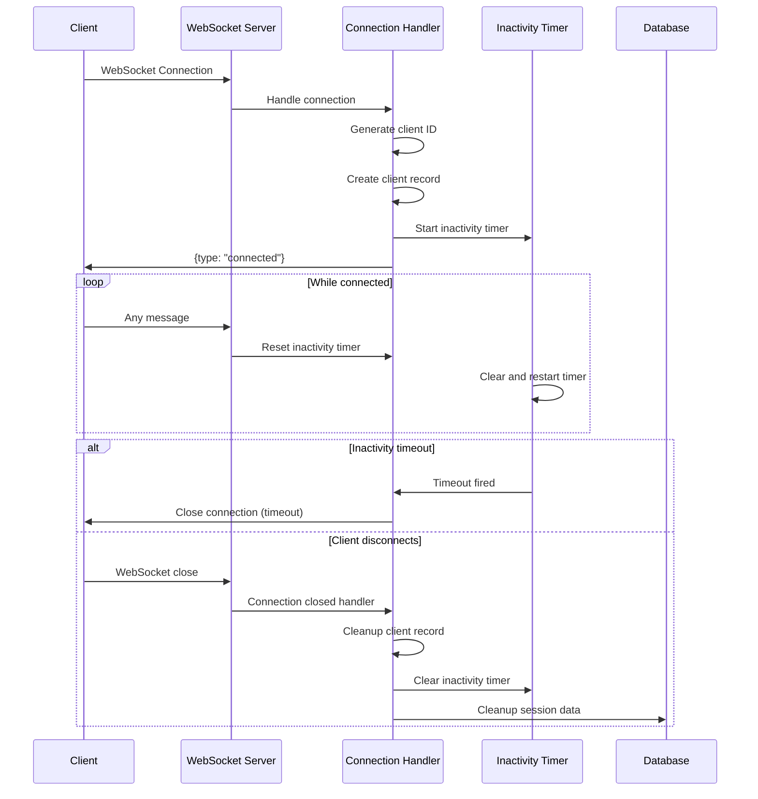

# Sequence Diagrams

Detailed sequence diagrams for key system interactions in a real-time messaging system.

## Authentication Flow

## Message Sending Flow (Online Recipient)

## Message Sending Flow (Offline Recipient)

## Reconnection and Event Delivery

## Group Message Flow

## Message Edit Flow

## Reaction Flow

## Connection Lifecycle

